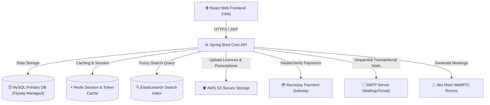
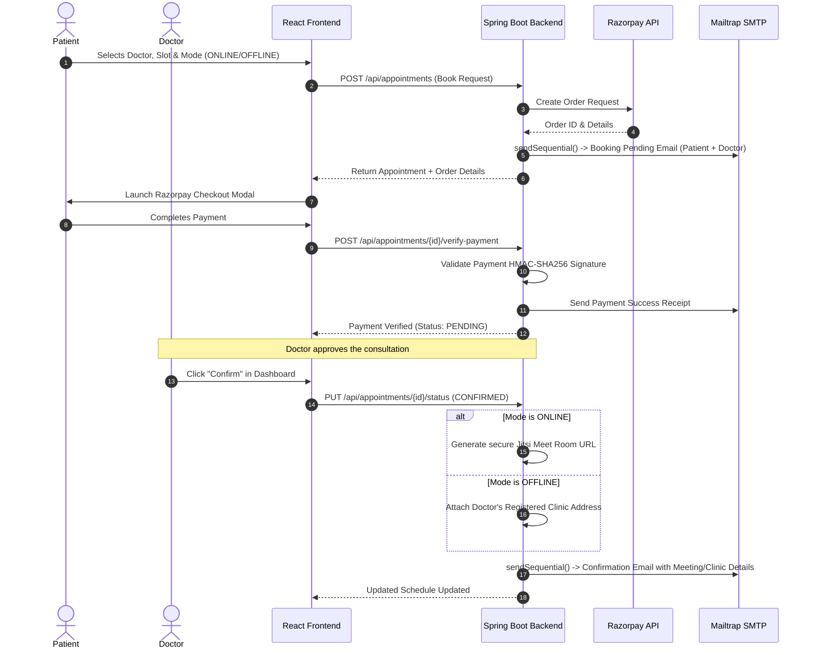

# 🏥 Hospital Management System (HMS)

An enterprise-grade, highly secure, and feature-rich full-stack health-tech platform designed to orchestrate the entire patient-doctor consultation lifecycle. Featuring a modern Glassmorphism UI, real-time consultation mode enforcement, secure Razorpay payment orchestration, zero-setup Jitsi Meet video consultation, and automated transactional email flows.

---

## 🏗️ System Architecture & Workflow

### 1. High-Level Component Design


### 2. Appointment Booking & Payment Orchestration Flow


---

## 🌟 Core Capabilities & Features

### 👤 Patient Experience
*   **Fuzzy Doctor Search**: Powered by **Elasticsearch**, enabling instant search by name, specialization, or hospital even with spelling errors.
*   **Flexible Consultation Modes**: Choose between 💻 **Online Consultation** (Video Call) or 🏥 **In-person Visit** (Clinic).
*   **Integrated Checkout**: Secured by **Razorpay Payment Gateway** with instant status verification.
*   **Personal Appointments Hub**: Access live status badges, dynamic clinic location details, download prescriptions, and join secure WebRTC consultation rooms directly with one click.

### 🩺 Doctor Experience
*   **Professional Onboarding**: Fully featured registration form with support for multiple consultation modes, hospital affiliations, clinic addresses, biography details, and secure medical board credential uploading (stored safely in **AWS S3**).
*   **Live Schedule Dashboard**: Review and manage incoming appointments, approve pending consultations, and launch video calls instantly.
*   **Smart Prescription Builder**: Seamlessly generate, sign, and issue digital prescriptions, which are automatically converted to PDFs and synchronized with the cloud.

### 🛡️ Enterprise-Grade Security & Performance
*   **JWT Multi-Token Architecture**: Secured via a dual JWT access token (30-minute expiry) and refresh token (7-day validity) mechanism, ensuring continuous user sessions without sacrificing safety.
*   **Rate-Limit Shield (Mailtrap Optimized)**: Implements custom `sendSequential()` async queueing with automatic 2.5-second thread delays to strictly respect SMTP rate limiters (e.g. Mailtrap free tier) and eliminate `429 / 550 Too many emails per second` errors.

---

## 🛠️ Technology Stack

| Layer | Technologies | Key Features Managed |
| :--- | :--- | :--- |
| **Frontend** | React 18, Vite, React Router DOM, Axios, Lucide React | Glassmorphism Dashboard, Responsive Forms, Interactive Video Triggers |
| **Backend** | Java 21, Spring Boot 3.2.5, MapStruct, Lombok | Layered MVC, Robust Business Validations, Custom @Async Notification Queue |
| **Security** | Spring Security 6, JWT, HMAC-SHA256 Verification | Secure Route Guards, Dynamic Access Tokens, Cryptographic Signature Validation |
| **Databases** | MySQL 8.0, Redis (Lettuce), Elasticsearch 8.10.1 | Primary Relational Storage, Low-latency Session Cache, High-performance Search Index |
| **Migrations** | Flyway DB | Auto-run Versioned Schema Management (V1 to V12) |
| **External APIs**| Razorpay, AWS S3 SDK, Jitsi WebRTC, Mailtrap SMTP | Online Billing, Cloud Documents, Zero-setup Consultations, Sequential Transaction Mails |

---

## 📦 Database & Schema Management (Flyway)

Our database is managed dynamically via Flyway migrations located in `backend/src/main/resources/db/migration`. 

> [!TIP]
> **Database Reset & Portability:** If you drop all tables or deploy to a completely blank database, simply restart the backend. Flyway will automatically execute migrations sequentially (`V1__...` through `V12__add_hospital_details_to_doctors`) to recreate all tables, relations, and default constraints in seconds.

---

## 🚀 Installation & Local Quickstart

### Prerequisites
*   [Docker & Docker Compose](https://www.docker.com/)
*   [Java 21 JDK](https://adoptium.net/)
*   [Node.js v18+](https://nodejs.org/)

---

### Step 1: Launch Infrastructure Services
Start the localized database and caching containers using Docker Compose:
```bash
docker-compose up -d
```
This spawns:
*   **MySQL**: `localhost:3307` (DB Name: `hms`)
*   **Redis**: `localhost:6379`
*   **Elasticsearch**: `localhost:9200`

---

### Step 2: Configure Environment Variables
Create or update `backend/src/main/resources/application.yml` with your test credentials:

```yaml
spring:
  # ─── Mail config (Mailtrap example) ───
  mail:
    host: sandbox.smtp.mailtrap.io
    port: 2525
    username: <your_mailtrap_username>
    password: <your_mailtrap_password>

razorpay:
  key-id: <your_razorpay_key_id>
  key-secret: <your_razorpay_key_secret>
```

---

### Step 3: Start the Backend Server
Navigate to the `backend` directory and compile/run the Spring Boot application:
```bash
cd backend
# On Windows
mvnw.cmd spring-boot:run
# On macOS / Linux
./mvnw spring-boot:run
```
*The Spring Boot server will initialize and begin listening on port `8080`.*

---

### 🌐 Access Swagger UI (API Testing Console)
Once the backend starts, company members can fully test the endpoints, inspect models, and execute requests directly from the interactive OpenAPI 3 console:
*   **Swagger URL:** `http://localhost:8080/swagger-ui/index.html`
*   **JSON Documentation:** `http://localhost:8080/v3/api-docs`

> [!NOTE]
> **Testing Secure Endpoints:** To test secure endpoints (e.g. creating/cancelling appointments), call the `/api/auth/login` endpoint, copy the returned `accessToken`, click the **"Authorize"** lock icon at the top of the Swagger page, paste the token, and click Authorize.

---

### Step 4: Start the Frontend Application
Navigate to the `frontend` directory, install dependencies, and launch the Vite development server:
```bash
cd frontend
npm install
npm run dev
```
*The React application will launch at `http://localhost:3000` (or `http://localhost:5173`).*

---

## 📧 Email Notification Sequence Summary

| Step | Recipient | Email Subject | Key Details Included |
| :--- | :--- | :--- | :--- |
| **1. Booking Pending** | Patient + Doctor | `HMS - Appointment Confirmed` | Notification that slot is reserved; Status: **Pending Confirmation** |
| **2. Payment Success** | Patient Only | `HMS - Payment Successful ✅` | Full financial receipt including Razorpay Transaction ID and next steps |
| **3. Appointment Confirmed** | Patient + Doctor | `HMS - Appointment Confirmed 💻 Video Link Inside` | **ONLINE**: Real, clickable **Jitsi Meet room**<br>**OFFLINE**: Registered Doctor **Hospital & Clinic Address** |
